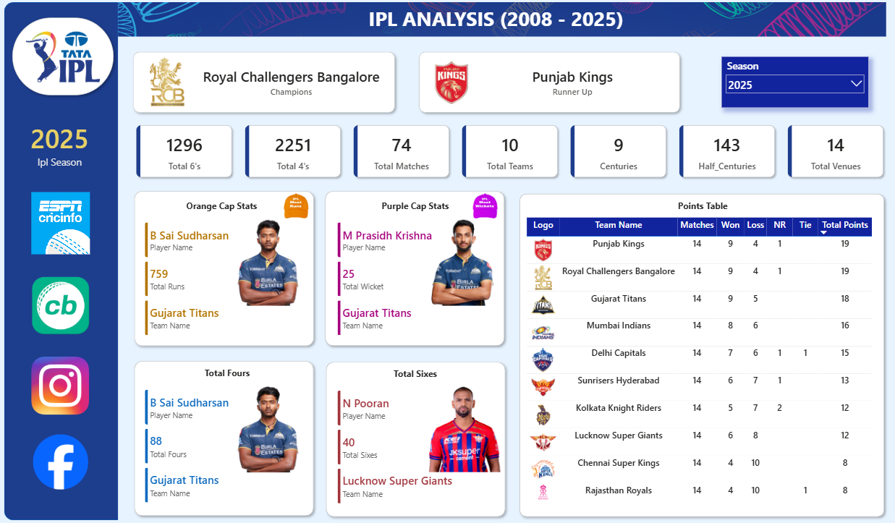

# 🏏 IPL Analysis Dashboard (2008–2025) | Power BI

An interactive **Power BI dashboard** that analyzes Indian Premier League (IPL) data from **2008 to 2025**. The dashboard provides season-wise insights into team performance, batting and bowling statistics, tournament records, and standings through dynamic visualizations and DAX-powered calculations.

---

## 📸 Dashboard Preview

---

## 📌 Project Overview

This project showcases an end-to-end sports analytics solution built using **Power BI**, **Power Query**, and **DAX**.

The dashboard enables users to explore IPL data interactively by selecting any season between **2008 and 2025**. It highlights tournament winners, Orange Cap and Purple Cap holders, team standings, batting records, and other key statistics.

---

## 🚀 Features

- 🏆 Season Champion & Runner-Up
- 📅 Season-wise Analysis (2008–2025)
- 🟠 Orange Cap (Highest Run Scorer)
- 🟣 Purple Cap (Highest Wicket Taker)
- 💥 Most Fours & Most Sixes
- 📊 Interactive KPI Cards
- 📋 Dynamic Points Table
- 🏟 Venue Statistics
- 📈 Tournament Statistics
- ⚡ Interactive Filters and Slicers

---

## 📊 Dashboard KPIs

- Total Matches
- Total Teams
- Total Venues
- Total Fours
- Total Sixes
- Total Centuries
- Total Half-Centuries
- Orange Cap Winner
- Purple Cap Winner
- Season Champion
- Runner-Up

---

## 🛠 Tools & Technologies

- Power BI Desktop
- Power Query
- DAX (Data Analysis Expressions)
- Data Modeling

---

## 📂 Dataset

The complete dataset is available on **Kaggle**.

**🔗 Download Dataset:**
https://www.kaggle.com/datasets/dhruvrapariya/ipl-dataset-2008-2025

### Dataset Files

- ball_by_ball_data.csv
- ipl_matches_data.csv
- players-data-updated.csv
- teams_data.csv

> **Note:** The datasets are hosted on Kaggle to keep this repository lightweight.

---

## 📈 Key Insights

- Season-wise IPL Champions
- Runner-Up Teams
- Orange Cap Winners
- Purple Cap Winners
- Team Points Table
- Batting Leaders
- Boundary Statistics
- Tournament Records
- Team Performance Analysis

---

## 🎯 Skills Demonstrated

- Data Cleaning
- Data Transformation
- Data Modeling
- DAX Calculations
- Power Query
- Interactive Dashboard Design
- Data Visualization
- Sports Analytics
- Business Intelligence

---

## ⭐ If you found this project helpful

Please consider giving this repository a ⭐ on GitHub.

---

## 👨‍💻 Author

**Dhruv Rapariya**
